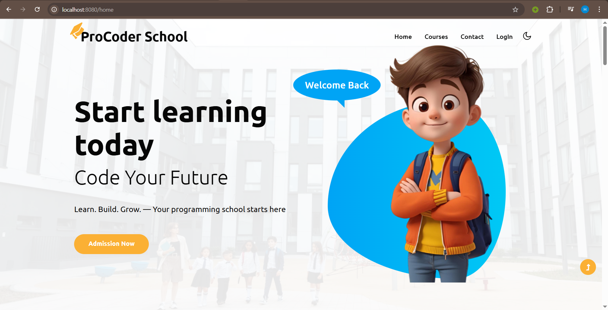

# ProCoder School

A comprehensive School Management System built with Spring Boot that provides a robust platform for managing school operations including student enrollment, course management, class management, contact queries(Q&A), and more.

## 📋 Features
- **User Management**
    - Role-based access control (Admin, Student)
    - Secure authentication and authorization
    - User profile management
- **Academic Management**
    - Course management
    - Class management
    - Student enrollment into class and courses
- **Administrative Management**
    - Contact management (Q&A regarding school)
    - Students management

## 👨🏻‍💻 Technologies Used
- **Backend**: Java 17, Spring Boot 3.x
- **Database**: PostgreSQL
- **Security**: Spring Security
- **Build Tool**: Maven
- **Other libraries & Frameworks**: Thymeleaf, Spring Data JPA

## 🔐 Security
- **ADMIN**: Full system acess
- **STUDENT**: Can view courses and personal information